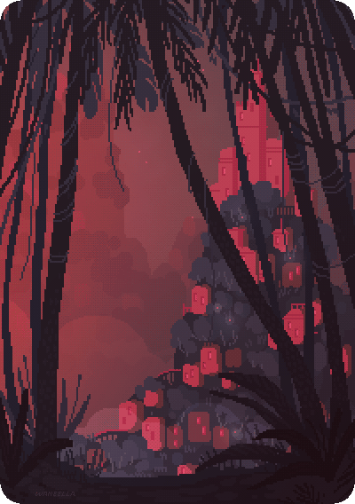
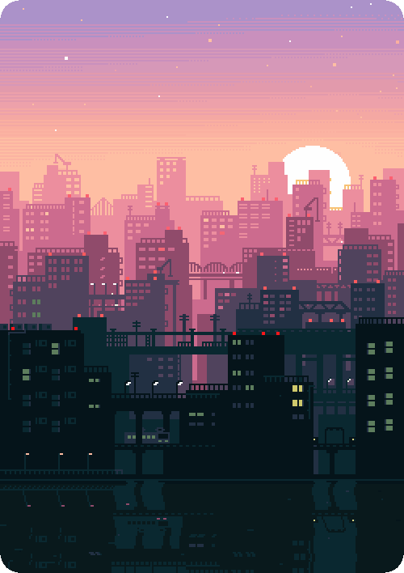
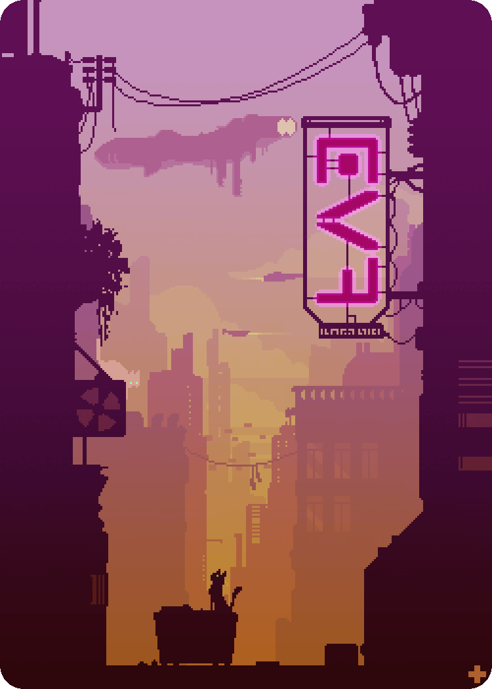

 

  
  
  

###

<h1 align="center">Здравствуй, меня зовут Игорь✌️</h1>

###

  

###

<h3 align="left">👩‍💻  Обо мне</h3>

###

Unity разработчик. Мой путь IT-самурая берет начало в далеком 2021 году (тогда я впервые открыл Unity и создал свой первый простенький проектик). За это время я успел выпустить полноценный крупный проект на игровую площадку VKPlay. Овладеть C#, C++ и Python, хотя с недавним скачком развития нейросетей нужда в изучении языков, к сожалению (а, может, и к счастью), почти исчезла. Также за это время я разработал немало мобильных коммерческих проектов под Android и iOS. Успел поработать со сферами автоматизации и AI (интеграции чат-ботов, анализ данных, машинное обучение). А еще коснуться разработки в сфере дополненной реальности (AR) и поработать дизайнером в некоторых проектах (в числе которых как игры, так и обычные приложения). Надеюсь, было приятно познакомится 😉

###
<h3 align="left">📕 Мои статьи</h3>

- [Кликер на Unity с использованием нейросети для генерации графики](https://habr.com/ru/articles/823684/)

###

 

###

<h3 align="left">⚙️ Осн. Технологии:</h3>

###

  
  
  
  
  

<h3 align="left">🛠 Доп. навыки:</h3>

###

  
  
  

